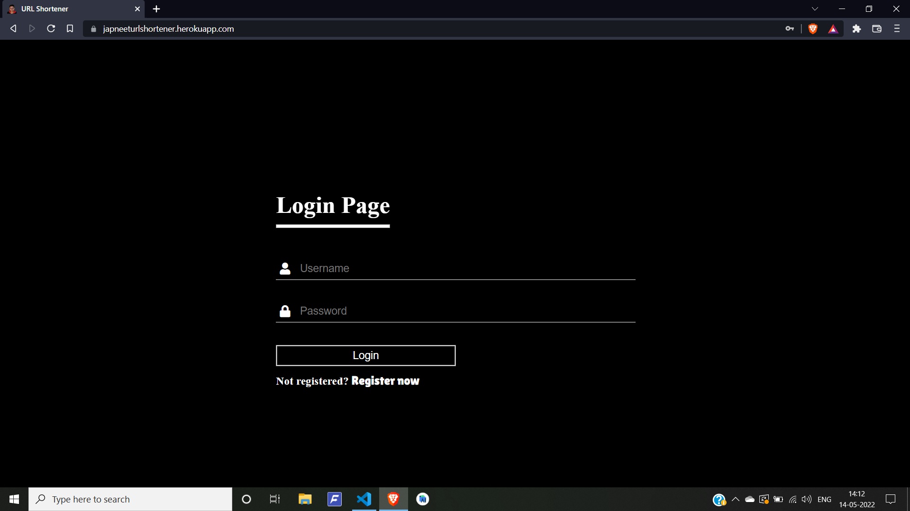
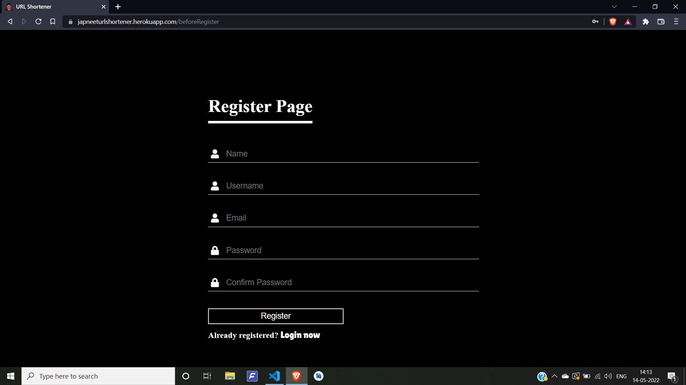
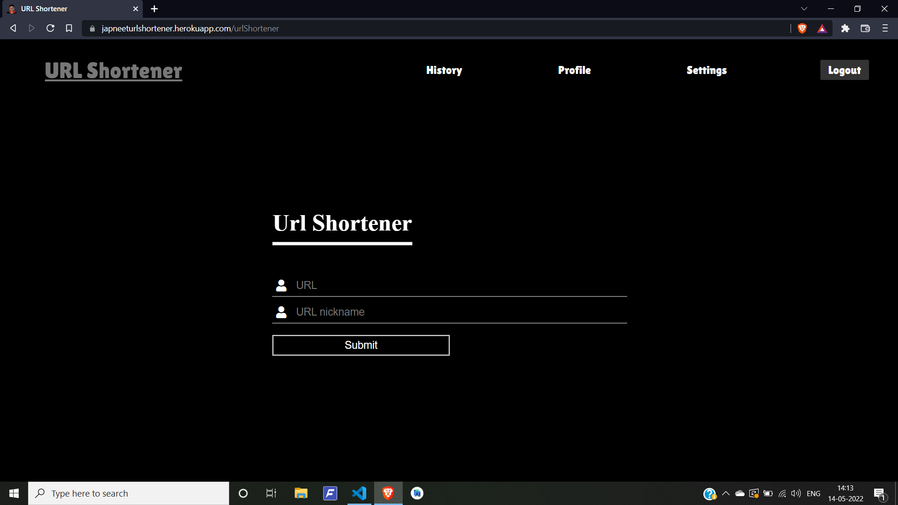
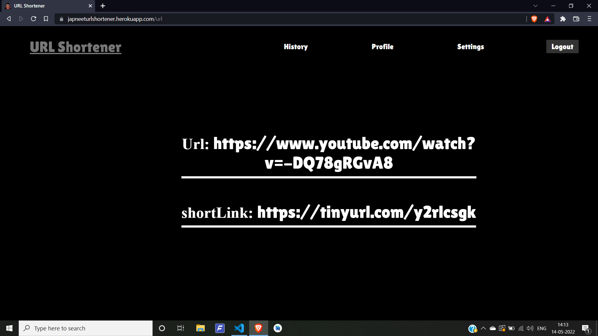

# Developer Details

[Japneet Rajput](https://github.com/JapneetRajput) 

[Portfolio Website](https://japneetrajput.github.io)

# Development
Please have python3 installed to run this project on terminal:
[Python3 Installation](https://www.python.org/downloads/)
Also install Xampp for DB and server
[Xampp Installation](https://www.apachefriends.org/download.html)

# Project Title
A URL Shortener is a tool that creates a short, unique URL that will redirect to the specific website of your choosing

## Prerequisites
Modules used in this app are Flask and PyShortener(installation guide given ahead)

## Initial Setup:

**Create DB and start Server**
1. Start MySQL and Apache server from the Xampp control panel.
2. Now go to MySQL Server Admin page -> SQL.
3. Now we will initialize the database schema.
4. For this, paste the queries given in initialize.sql in the SQL window and click on go (created local DB).

#### NOTE: If you have changed the database name in the query then change it in other files too (app.py) 

**Create Config file**
1. The settings.py is going to fetch values from this file. 
2. So create a .env file in you base project folder.
3. Enter required values according to your local database and preferences.

#### NOTE: we use file types like .env as they are ignored by github on pushing to repo. This is done because it contains your local configs for your system and may contain sensitive info.

**Setting Environment**
Do the following by typing these commands on python terminal of your IDE

Install the Virtual Environment module

    pip install virtualenv

Create a virtual environment

    virtualenv venv

Activate the Virtual Environment

    venv\scripts\activate.bat

Install the required modules

    pip install -r requirements.txt

**To run the project**
<!--Remove the below lines and add yours -->

Run the app 

    flask run

## How to contribute
    
Check out our [Contributing Documentation](https://github.com/CMPN-CODECELL/URL-Shortener/blob/main/CONTRIBUTING.md) 

### Note

1. First create issue for the task which you would like to contribute to by explaining your approach in it.
2. Project maintatiners will assign the issue to you if it's worthy and not repeated.
3. While creating pull request mention the issue number in it.

## Guidelines

The first step is to register yourself on the [Hacktoberfest website](https://hacktoberfest.com/) using your Github account and sign up as a student.

Find the open source repositories which interest and go try to pick up issues which you can solve.If you don't find one and think you can improve the codebase create a issue stating the problem you want to solve using the proper guidelines. Once the issue is assigned to you, code away till you resolve the issue :nerd_face: . Once you are done with the coding create a pull request by following the proper **CONTRIBUTING.md** file given in the repository. If the repository doesn't have one, make a pull request following the accepted rules in the open source community :hugs:

You have to make 4 pull requests on any valid repositories. Once you make the pull request, there is a review period of two weeks. **PLEASE MAKE QUALITY PULL REQUESTS AND NOT SPAM** :rage:  If you make spam pull requests your pull request will be deemed invalid/spam and you will be unelligible to win swag 

## Prizes

Make 4 valid Pull requests in the month of October to be elligible for a limited edition T-shirt or plant a tree :innocent:. The first 40,000 winners are elligible for the prizes.

### If this repository helped you in anyway, please leave a star :star: on our repository :blush:

## Screenshots of the project
<!--Remove the below lines and add yours -->
Login/Register:

A user can create an account by registering and later use the credentials to login
to use our tool. Login/register credentials are stored in the MySQL database.

Url Shortener tool:

A user can shorten their(Long) Urls using our shortener tool by entering the url
and assigning a nickname to it So that later when he checks the history they’ll get to
know which link corresponds to which website.

History:

All the URLs shortened by a user are stored in the MySQL database which are
later displayed in the history section.

Profile:

This page shows the user details and the user has an option to update his profile.

